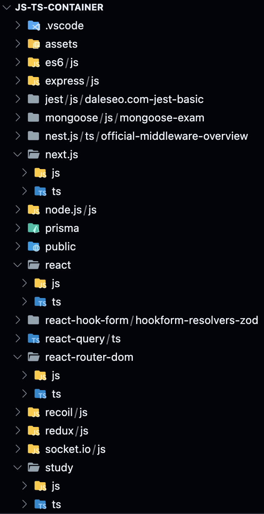
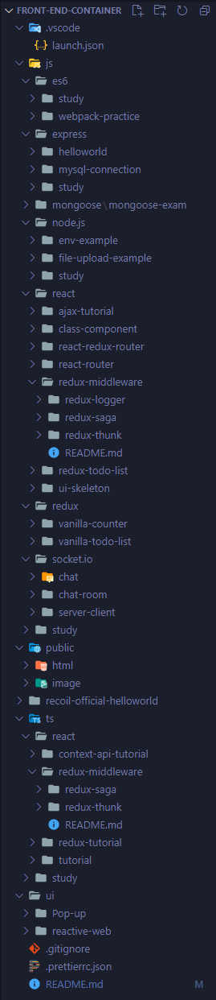

## 2023-05-21

### Refactor

- 대부분이 `TS` 으로 개발되고 `JS` 와 `TS` 으로 개발되었다는 것이 중요한 정보가 아니게 됨에 따라 `JS` , `TS` 언어별로 구별하던 디렉터리 계층을 제거했습니다.
- 불필요한 프로젝트를 정리하거나 올바른 위치로 변경했습니다.

### 디렉터리 구조

> TODO: 추가 예정

## 2021-04-08

### Refactor

직접적으로 알고 싶은 정보는 어떤 module이 있으며 무슨 언어로 제작되었는지 이지만 `JS` 와 `TS` 으로 구분을 시작하니 module의 종류보다 각 언어 별로 몇 개의 module이 제작되었는지가 중점적으로 표시되었습니다.

제품 종류가 많아지면서 원하는 정보를 찾는데 많은 cost가 소모되었습니다.

이에 따라 동일한 제품(module) 별로 구분하도록 합니다.

```
/
└─{제품}
   └─{언어}
      └─{출처}-{섹션}
```

> 영어는 모두 소문자입니다.

아래의 조건에 따라 분류되었습니다.

1. 제품
   1. 사용된 라이브러리 및 프레임워크를 기술합니다.
      > react, es6
   1. 반드시 라이브러리 및 프레임워크일 필요는 없으며 해당 제품(기술)을 상징할 수 있는 하나의 단어이면 됩니다.
1. 언어
   1. 사용된 프로그래밍 언어를 기술합니다.
      > js, ts, dart
1. 출저
   1. 어떤 문서를 레퍼런스하여 제작했는지 기술합니다.
      > official, youtube.{유튜버 이름}
      1. 만약 `official`이라면 해당 제품의 공식 문서를 참고했다고 이해하고 추적할 수 있는 단서를 제공하는 것이 가치입니다.
      1. 혹은 블로그 글을 참고하는 경우 주소가 `https://poiemaweb.com/`이라면 `{poiemaweb.com}-{study}`가 될 수 있습니다.
         1. 하위 주소의 경우 무시합니다.
         1. 그룹화가 주된 목표입니다. 디렉터리 이름으로 대략적으로 블로그 위치를 추적할 수 있는 단서를 제공하고 세부 링크는 `README.md`에 기입합니다.
1. 섹션
   1. project를 구분할 수 있는 이름으로 기술합니다.
      > study, tutorial
   1. 실질적으로 project 이름이 되는 부분입니다.

예시는 아래와 같습니다.

```
/
└─recoil
   └─js
      ├─official-basic-tutorial
      └─official-helloworld
```

### Commit message 컨벤션

history를 트래킹 할 수 있도록 큰 이벤트마다 여러 번 구분하여 커밋하도록 합니다.

> 핵심 가치는 `commit type`만으로 해당 커밋을 유추할 수 있어야 합니다.

| type     | 내용                                                                   |
| -------- | ---------------------------------------------------------------------- |
| init     | hello, world 수준의 동작이 검증된 첫 파일을 추가할 때                  |
| add      | 코드나 테스트, 예제, 문서 등의 추가가 있을 때                          |
| del      | 파일 또는 코드, 리소스 제거                                            |
| up       | 원래도 정상동작 하지만 추가 보안 하는 개념                             |
| fix      | 올바르지 않은 동작을 고친 경우에                                       |
| docs     | 문서 수정                                                              |
| refactor | 코드 리팩토링 (변수명 수정 등) 기능에는 변함이 없어야합니다            |
| style    | 코드 인덴트 변경으로 인한 코드 스타일 변경, 코드 자체 변경이 없는 경우 |
| ci/cd    | ci/cd와 같은 행위를 강제로 수행해야 할 때 (강제로 수행한 이유 작성)    |
| use      | 특별히 무언가를 사용해 구현을 하는 경우                                |
| move     | 코드 및 파일의 이동이 있을 때                                          |
| rename   | 파일명이 변경될 때                                                     |

### 디렉터리 구조



## <2021-04-08 (init)

`JS` 와 `TS` 으로 구분해서 `module` 를 구분합니다.

### 디렉터리 구조


