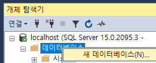
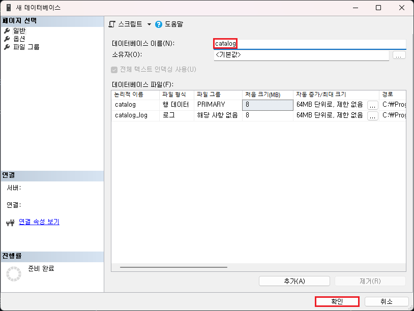
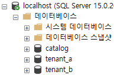
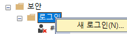
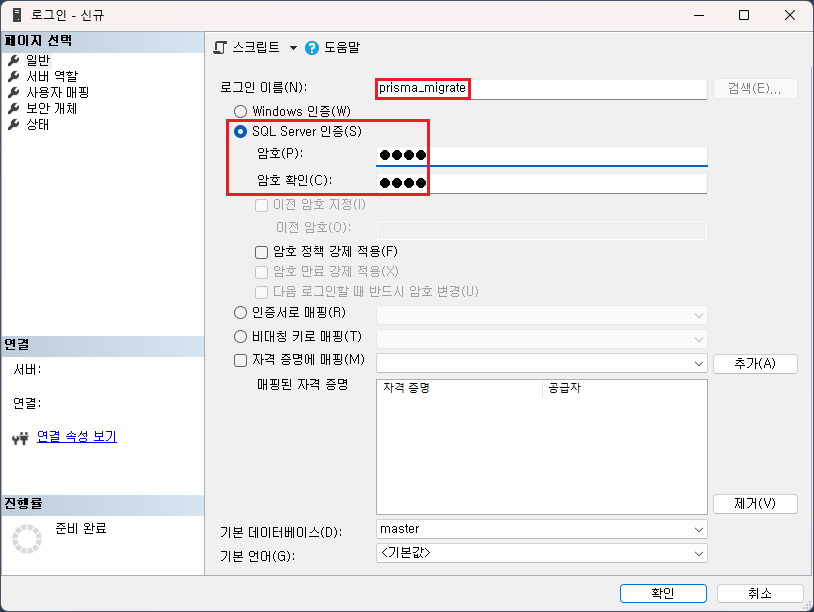
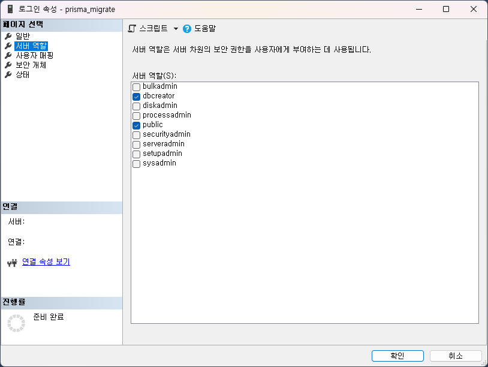
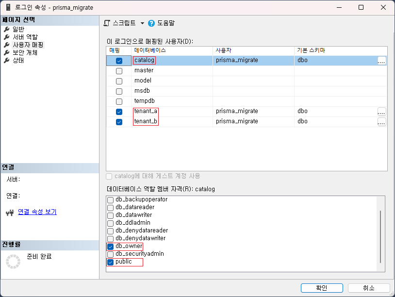

## Overview

1. `prisma` 를 이용하여 `멀티 커넥션` , `멀티 스키마` 를 달성하는 프로젝트 입니다.
1. [Prisma 설정하기 / 처음부터 시작 하기 / 관계형 데이터베이스](https://www.prisma.io/docs/getting-started/setup-prisma/start-from-scratch/relational-databases-typescript-sqlserver) 문서를 통해 `prisma` 와 `SQL Server` 연결 작업에 대해 도움을 받을 수 있습니다.

## Stack

1. Windows 11
1. Node@v16.15.0
1. SQL Server 2019

## 컨셉

`prisma` 를 이용하여 `여러개의 DB 커넥션` 을 가지고 스키마가 다른 `prisma client` 를 이용하도록 합니다.

이를 통해 멀티 테넌트 DB 구조 디자인을 `prisma` 를 이용하여 사용할 수 있는 방법을 알 수 있습니다.

> 
>
> https://learn.microsoft.com/ko-kr/azure/azure-sql/database/saas-tenancy-app-design-patterns?view=azuresql#d-multi-tenant-app-with-database-per-tenant

## 전제 조건

1. 앱을 실행할 수 있도록 `Node.js` 가 설치되어 있어야 합니다.
1. `SQL Server` 에 앱이 접근할 수 있어야 합니다.
   1. `SQL Server` 가 `listen` 중 이어야 합니다.
   1. `SQL Server` 의 `보안` 이 `SQL Server 및 Windows 인증 모드` 이어야 합니다.
   1. `SQL Server` 이 `TCP/IP` 를 사용 중 이어야 합니다.

추가적으로 아래의 작업을 통해 `사용할 DB` 와 `prisma migrate` 가 스키마 프로비저닝 할 계정을 만들도록 합니다.

### DB 생성

`SQL Server` 에 아래의 `DB` 를 생성합니다.

```
catalog
tenant_a
tenant_b
```

| DB 생성             | 특별한 옵션 지정하지 않고 DB 이름만 지정 | 모두 생성 시 아래와 같을 것입니다 |
| ------------------- | ---------------------------------------- | --------------------------------- |
|  |                       |                |

### 사용자 생성

아래의 권한을 가진 사용자를 생성합니다.

| 로그인 생성         | `SQL Server 인증` 으로 선택 | `public` 과 `prisma_migrate` 가 스키마 프로비저닝 할 수 있도록 `dbcreator` 추가 | `catalog` , `tenant_a` , `tenant_b` 모두 동일하게 아래와 같이 DB 권한 추가 |
| ------------------- | --------------------------- | ------------------------------------------------------------------------------- | -------------------------------------------------------------------------- |
|  |          |                                                              |                                                         |

## Start

> `cmd` 에서 실행했습니다.

> 커넥션 스트링은 IP, DB, 계정에 맞게 변경하시면 됩니다.

```shell
npm i

# 우선 `catalog` 를 위한 커넥션 string을 지정합니다.
set DATABASE_URL=sqlserver://localhost:1433;database=catalog;user=prisma_migrate;password=1234;trustServerCertificate=true;
# 아래의 명령어로 마이그레이션(스키마 프로비저닝) 을 진행합니다
npm run catalog-db-push

# 나머지 `tenant_a` 도 진행
set DATABASE_URL=sqlserver://localhost:1433;database=tenant_a;user=prisma_migrate;password=1234;trustServerCertificate=true;
npm run tenant-db-push

# 나머지 `tenant_b` 도 진행
set DATABASE_URL=sqlserver://localhost:1433;database=tenant_b;user=prisma_migrate;password=1234;trustServerCertificate=true;
npm run tenant-db-push

# 실행 후 console과 DBMS에 적재된 데이터 확인
npm run start
```
