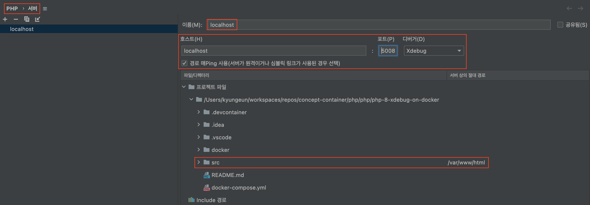

## 개요

> 쌍둥이격 프로젝트로 [php-5-xdebug-on-docker](../php-5-xdebug-on-docker/README.md) 가 있습니다.

`php@8` 버전에 `Docker` 환경에서 `Xdebug@3` 을 사용하는 환경입니다.

아래의 기능을 제공합니다.

- `Xdebug@3` 예제
- `Container` 환경 안에서 디버깅하는 예제와 `로컬 머신` 에서 디버깅하는 예제
  - `root` 에 있는 `.vscode/launch.json` 이 원격에서 디버깅할 때 사용되는 것이고 `src/.vscode/launch.json` 이 컨테이너 안에서 디버깅할 때 사용되는 것임
- `VSCode` 에서 `PHP` 개발할 수 있는 환경 제공 (i.e. `PHP Intelephense` )
  - **오해하면 안되는 것이 `VSCode` 에서 `PHP` 를 위해서 특별히 환경설정 할 것은 없으며 해당 프로젝트에서 기본적인 것은 되어서 확인이 쉽다는 것이지 복잡한 환경 구성을 저장한 프로젝트는 아닙니다.**

## 시작 방법

기본적으로 `docker` 를 실행하고 사용하면 됩니다.

```shell
docker-compose up -d
```

- http://localhost:50080/sample.php 으로 접속하면 웹 사이트를 확인할 수 있습니다.
- `VSCode` 의 경우 `root` 에서 `F5` 를 통해서 디버깅하거나 `Dev Containers` 으로 `Container` 에 들어가서도 디버깅할 수 있습니다.
  - 사전에 `CLI` 으로 `docker-compose` 를 실행한 경우 `실행 중인 컨테이너에 연결` 을 선택하세요.
  - 이미 동일한 `Container` 실행 중인데 `컨테이너에서 다시 열기` 하면 충돌합니다.
  - 당연한 사실인데 실수한 이력이 많아서 문서화 합니다.
- `VSCode` 에서 `Listen for Xdebug` 으로 `CLI` 에서 실행되는 `PHP` 에 대해서 디버깅할 수 있거나, `Launch currently open script` 으로 파일 단위로 디버깅할 수 있습니다.
  - `Launch currently open script` 를 통해서 열려있는 파일 디버깅
    - 웹에서 접속 시 동작하기 위해서 `xdebug.remote_host` 가 설정되어있기 때문에 `VSCode` 의 `launch.json` 에서 `runtimeArgs` 으로 `localhost` 를 넣어주는 예제를 볼 수 있습니다.
- `VSCode` 에 종속된 환경이 아니며 `Phpstorm` 에서도 `Xdebug` 가 잘 동작하는 환경입니다.
  - `Phpstorm` 에서 해당 프로젝트를 열고 `디버깅 listen` 상태에서 `breaking point` 를 걸고 `웹 페이지` 를 새로고침하면 `Xdebug` 가 자동으로 인식되어 `서버` 관련 설정이 나올 것 입니다.
  - 추가적으로 아래와 같이 경로 맵핑을 하면 됩니다.
    
